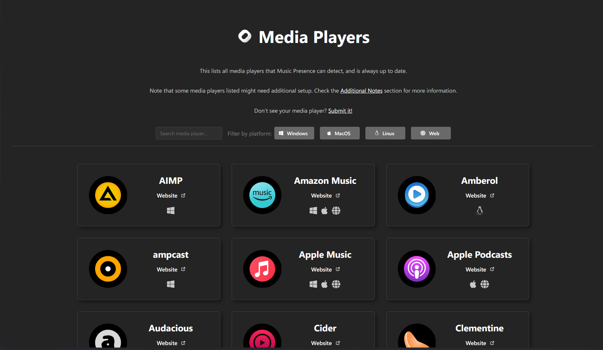
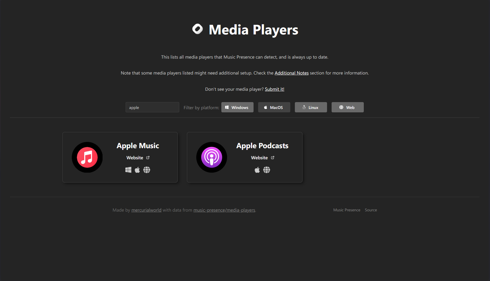

# Media Players Web Page

A single web page that populates itself from a call to the Music Presence media players API. Only uses React.

The search bar only filters by the official, human-readable name. The filters check for the existence of sources for each platform.

## How to run

Install [Deno](https://deno.land). Then, run

```sh
deno install
deno run dev
```

To preview the production build, run
```sh
deno run build
deno run preview
```

# Preview




